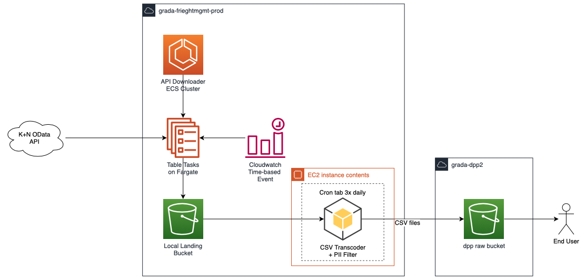

# ASPIRE Freight Management Service Infrastructure
Confluence page [here](https://sainsburys-confluence.valiantys.net/pages/viewpage.action?pageId=112648616).

## Background

Kuehne + Nagel (K+N) provides our main Stock on Water information. Metrics from them are used to facilitate Argos Stock 
holding and Supply Chain reporting as part of General Merchandising and Clothing (GM&C) consolidated stock piece. Users
of this consolidated piece are Merchanidse, Finance, and CRAFT team.

Users require shipment data to carry out reporting, using data extracted from K+N via Excel sheets, and then loaded into
a limited MS Access database.

## Purpose



This service is to automate the data extraction process by downloading data from the K+N API (using this [Python
app](https://github.com/sainsburys-tech/aspire-nfsc-freightmgt-api-downloader-service)) and then loading data into
ASPIRE. 

See the [confluence page](https://sainsburys-confluence.valiantys.net/pages/viewpage.action?pageId=112648616) for the 
architecture diagrams for all iterations of the solution.

Currently the second iteration of the solution is deployed, where the Python API Downloader is running on ECS on 
Fargate, scheduled at 05:00, 10:00, and 13:00 (UTC) (06:00, 11:00, and 14:00 BST). The Transcoder is running on CRON schedule on an EC2 instance, scheduled
at 05:45, 10:45, and 13:45 (UTC) (06:45, 11:45, 13:45 BST).

Please see 
[this](https://sainsburys-confluence.valiantys.net/pages/viewpage.action?pageId=108489131) confluence page for runbook
instructions.

## Design

This service will create:
* VPC, subnets, and internet gateway
* S3 access and flow logs
* CloudWatch log groups
* ECS Cluster
* ECS service and tasks scheduled with CloudWatch events (aka EventBridge)
* IAM Roles for ECS execution, ECS events, and ECS tasks
* EC2 instance with Packer and Ansible
* CloudWatch alarms and dashboard for the metrics

## Usage

### Table Configuration

In `/configs` there is a yaml file called `table-config.yml` which details the table names and individual settings
allocated for each task, such as memory and CPU.

The layout:
```yaml
---
<TABLE NAME 1>:
    cpu: <CPU VALUE>
    memory: <MEMORY VALUE>
    rlimit: <RESOURCE LIMIT VALUE>
    row_threshold: <ROW THRESHOLD VALUE>
<TABLE NAME 2>:
    cpu: <CPU VALUE>
    memory: <MEMORY VALUE>
    rlimit: <RESOURCE LIMIT VALUE>
    row_threshold: <ROW THRESHOLD VALUE>
...
```

|Setting|Description|Example|
|-------|-------|-------|
|`cpu`|CPU to be allocated for a task |`2048`|
|`memory`|Memory to be allocated for a task (MB)|`4096`|
|`rlimit`|Resource limit (GB) | `2` |
|`row_threshold`| The minimum row number that is used as a static threshold for the CloudWatch alarms | `2650`|


Example:
```yaml
---
containers:
    cpu: 1024
    memory: 3072
    rlimit: 2
    row_threshold: 2650
shipments:
    cpu: 1024
    memory: 3072
    rlimit: 2
    row_threshold: 4852
```

### Deployment
There is currently no CI/CD pipeline for this repository.
All deployments must be manual.

#### Packer

Ensure Packer and Ansible are installed locally

- Confirm if packer is already installed `packer --version`
    - If not, install with brew:
    ```
    brew tap hashicorp/tap
    brew install hashicorp/tap/packer
    ```
- Confirm if ansible is already installed `ansible --version`
    - If not, install with brew: `brew install ansible`

Ansible holds and preserves environment as a special variable.

- Copy your sainbury's tech repo SSH private key to tne ansible files directory
```
cp $SAINSBURYS_TECH_REPO_PRIV_KEY_PATH $GIT_CODE_HOME/aspire-nfsc-freightmgt-infrastructure/ansible/files/id_rsa

i.e.

cp ~/.ssh/my_private_key ~/Code/aspire-nfsc-freightmgt-infrastructure/ansible/files/id_rsa
```
- Build the packer AMI from the main directory:
```
packer build -var 'account=$ENVIRONMENT' ./packer/packer.json
```  
whereby `$ENVIRONMENT == dev || preprod || prod`

#### Terraform

* Initialise terraform: `terraform init`
* Check workspace: `terraform workspace list`
* If necessary, change workspace to the appropriate environment: `terraform workspace select <ENV>`
* Check the plan: `terraform plan -out "plan.out"`
* Apply: `terraform apply "plan.out"`


#### Deployment using Voyager Components
Confluence page [here](https://sainsburys-confluence.valiantys.net/pages/viewpage.action?spaceKey=APPLE&title=Deploying+Voyager).
